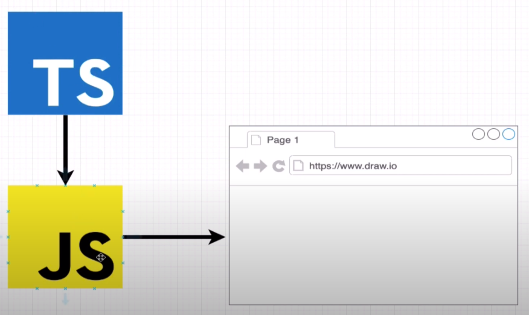
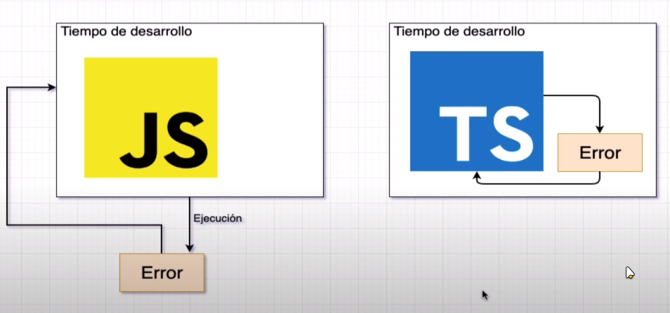
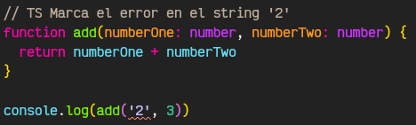
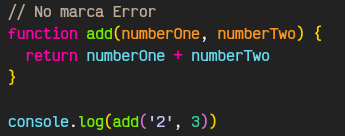
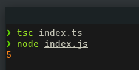
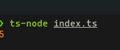

# 01. Introducción a TS

### **Que es TypeScript ?**

> TypeScript es un lenguaje de código abierto que se basa en JavaScript, una de las herramientas más utilizadas del mundo, al agregar definiciones de tipos estáticos.



### **Porque usar TS si ya tenemos JS**

**Typado Estático:** Si tenemos un error en el código de JS no lo vamos a detectar hasta verlo en el navegador, en cambio con TS nos advierte de los errores antes de que se llegue a ejecutar en el navegador.



**Ejemplo**





### **Instalación**

Para poder trabajar con TS necesitas tener instalado NodeJs, NPM y TypeScript te dejo un enlace al sitio oficial de cada uno.

-   [NodeJs + NPM](https://nodejs.org/es/) Descargar e instalar
-   [TypeScript](https://www.typescriptlang.org/) Una vez tengas npm ejecuta `npm install typescript` en la terminal, si usas Linux utiliza o Mac utiliza `sudo npm install -g typescript`

### **Tu primer función con TS**

Crea una, cárpete y crea un archivo index.ts dentro coloca la siguiente función.

```jsx
// Puedes especificar el tipo de dato que recibe la función (number, string, etc...)
// Solo tienes que colocar dos puntos luego del nombre del parámetro "param: type"
function add(numberOne: number, numberTwo: number) {
  return numberOne + numberTwo
}

console.log(add(2, 3))

```

Al momento de descargar TS también se te descarga un compilador para volver tu código TS a código JS, solo tienes que dirigirte a la carpeta donde está el archivo que creamos y escribe

`$ tsc "nombre del archivo en este caso index.ts"`

Si todo sale bien te creará un archivo JS con el mismo nombre el cual podrás ejecutar con node de la siguiente forma `$ node index.js`



Si quieres compilar y ejecutar con un solo comando te recomiendo instalar el siguiente paquete

`$ npm install -g ts-node` recuerda colocar sudo si utilizas Linux o Mac. Una vez instalado solo tendrás que ejecutar `ts-node "nombre del archivo"`

