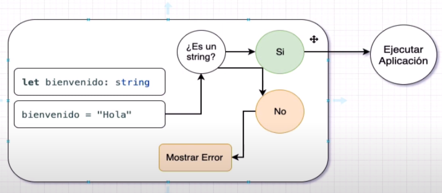
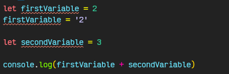

# 02. Tipos de variables en TS

### **Que pasa cuando crear una variable en TS ?**

> En Ts al momento de declarar una variable tienes que definir el tipo de variable que es colocando dos puntos, entonces donde en JS una variable se define de esta forma `let myVariable` en TS se definiría de la siguiente forma `let myVariable:string` si lo que quisiéramos es declarar un string.



### **Tipos de datos en TS**

- Tipo numérico `let myVariable:number`
- Tipo string `let myVariable:string`
- Tipo boolean `let myVariable:boolean`
- Cualquier tipo `let myVariable:any` puede almacenar cualquier tipo de dato

### Cambio de tipo de variable

En JS podemos declarar una variable y luego cambiar su tipo sin ningún problema

```jsx
let firstVariable = 2
firstVariable = '2'

let secondVariable = 3

console.log(firstVariable + secondVariable)
// Sin embargo esto puede ocasionar problemas
// output 23
```

En cambio en TS nos marca un error al intentar cambiar el tipo de variable


