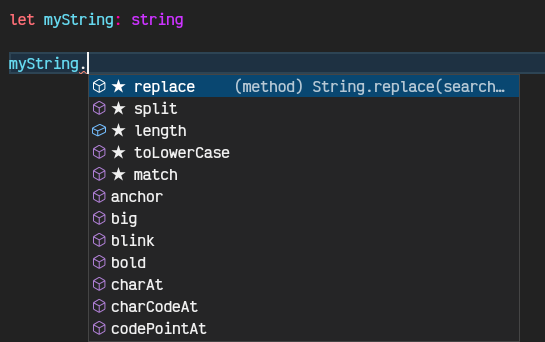

# 03. Formas de declarar una variable en TS

## **Anotación de tipos**

Nosotros indicamos a TS que tipo de dato utilizar en una variable

```jsx
// Anotación de tipos
let myNumber: number
let myString: string
let myBoolean: boolean
```

## **Inferencia de tipos**

TS se encarga de colocar el tipo de variable dependiendo del valor inicial que se le dé.

```jsx
// Inferencia de tipos

let myMultiplication = 2 * 3
// No hay error pero ahora esta variable sera de tipo number
// Si decidimos asignar otro dato nos dará error
myMultiplication = 'Qua Code'

console.log(myMultiplication)
//output: index.ts:37:1 - error TS2322: Type 'string' is not assignable to type 'number'.
```

> **Así mismo podemos acceder a todos los métodos correspondientes a cada tipo de variable**

