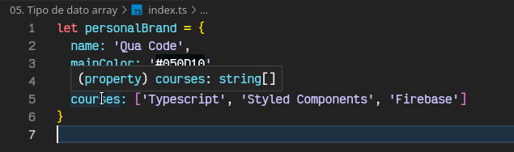
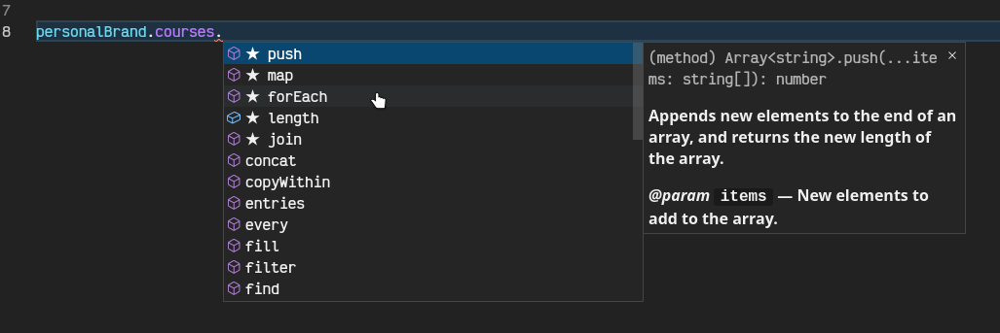
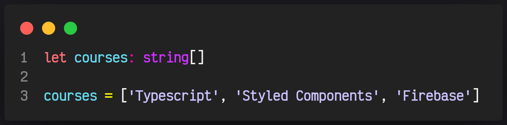
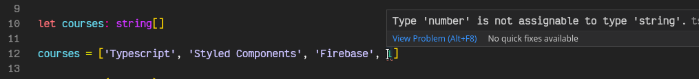

# 05. Tipo de dato array

Para este primer ejemplo utilizaré el mismo un objeto en el cual incrustaré un array para mostrarles la diferencia de un array en JS y TS.

A simple vista podemos ver que son lo mismo, pero quiero que notes que al colocar el cursor encima nos muestra que es un `string` con la diferencia que ahora coloca dos corchetes `[]` esto nos indica que es un array de string, así de simple podríamos saber el tipo de dato y acceder a sus métodos.

Otra forma de declarar un arreglo es hacerlo independientemente.

Sin embargo, al declarar un array como `string[]` al intentar introducir otro tipo de dato a este array TS nos marcara un error

Para solucionar este tipo de problemas conoceremos el tipo de dato `any` en TS tenemos el tipo de dato any que nos permite ingresar cualquier valor, ahora poder ingresar cualquier tipo de dato a mi array

