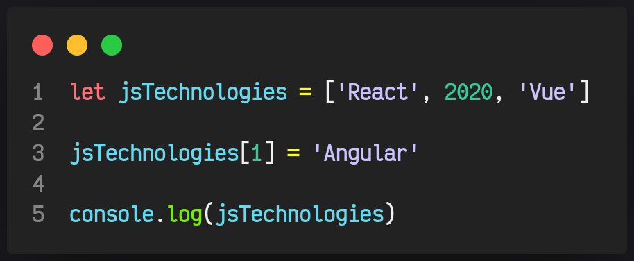
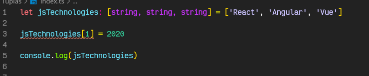
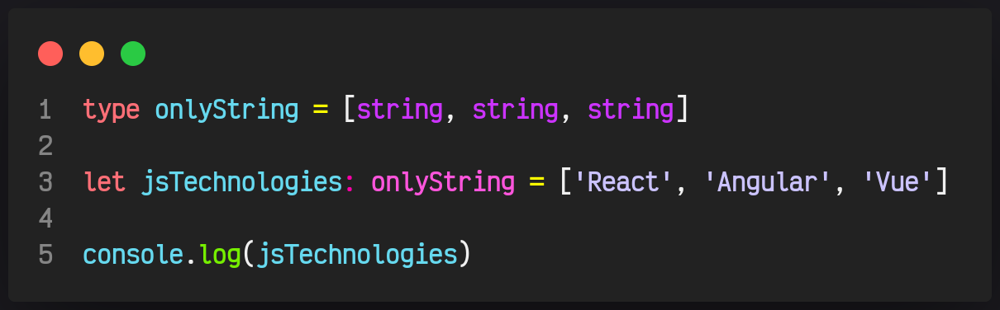
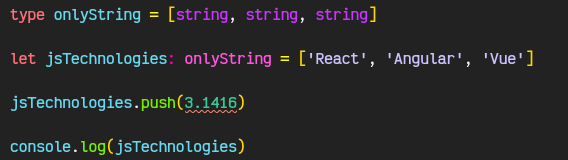

# 06. Tuplas

Las tuplas son muy parecidos a los arrays, con la diferencia que podemos definir el tipo de dato que guardara individualmente para cada elemento del array.

Supongamos que tenemos un array donde guardaremos una lista de las distintas tecnologías de JavaScript.

Pero accidentalmente se nos fue un numero un tipo de dato que no requerimos en ese array, para evitar ese tipo de problemas existen las `Tuplas`

Entonces con una tupla nos ahorraríamos este tipo de problemas al momento de escribir código.

### Una tupla

A diferencia de un array con una tupla podremos definir el tipo de cada elemento del array y TS nos maraca un error al momento de asignar un tipo de dato diferente al que definimos.

Otra forma de declarar una tupla es declarando el tipo y luego asignando de esta forma podremos declarar varias tuplas reutilizando él `type`

De igual forma podremos utilizar los métodos de un array y si el tipo de dato no coincide nos marcara un error.

