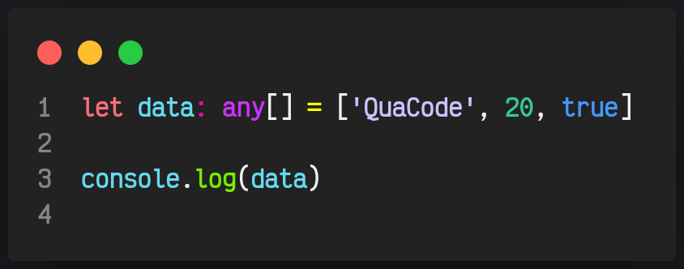

# 07. Any

Hablaremos un poco sobre el tipo de dato Any.
Si recuerdan con este tipo de dato podremos utilizar cualquier tipo sin restricción alguna

**Esto no es lo más recomendable** ya que hace que utilizar TS pierda completamente el sentido y abre la puerta a obtener diversos errores