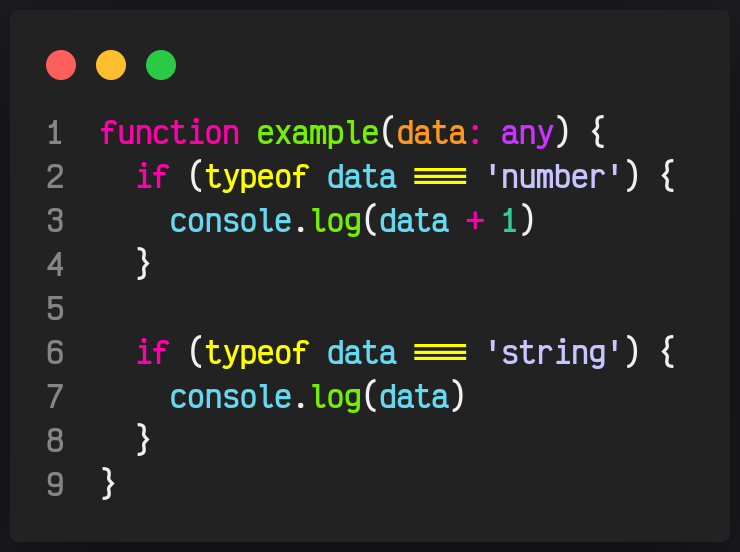
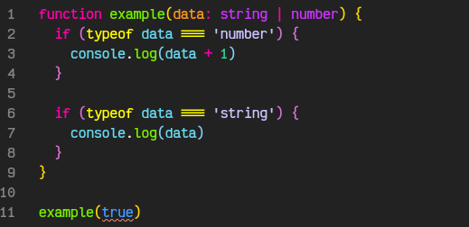

# 08. Union

Con este tipo de dato podremos asignar distintos tipos a una variable simplemente separando cada tipo con el signo `|` 

Supongamos que tenemos una función y queremos que si recibe un string nos escriba por pantalla el string pero si recibe un numero nos escriba por pantalla la suma del número ingresado más uno

Podríamos tomar este tipo de opción, pero no estaríamos aprovechando el poder de TS y aparte al utilizar `any` cabe la posibilidad de que nos envíen un tipo de dato distinto a  `number` o `string` y eso nos ocasione un bug.

Para eso podremos utilizar `Union` nos ahorraremos muchos problemas gracias a él, ahora nuestra función quedaría de la siguiente forma.

Simplemente cambiando `any` por `string | number` nos aseguraremos de no aceptar cualquier otro tipo de dato y además notar que al llamar nuestra función y pasarle un tipo de dato que no está permitido nos marca un error.