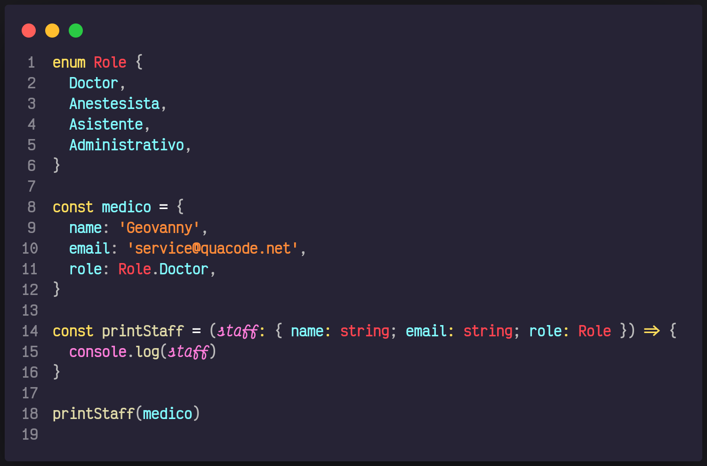
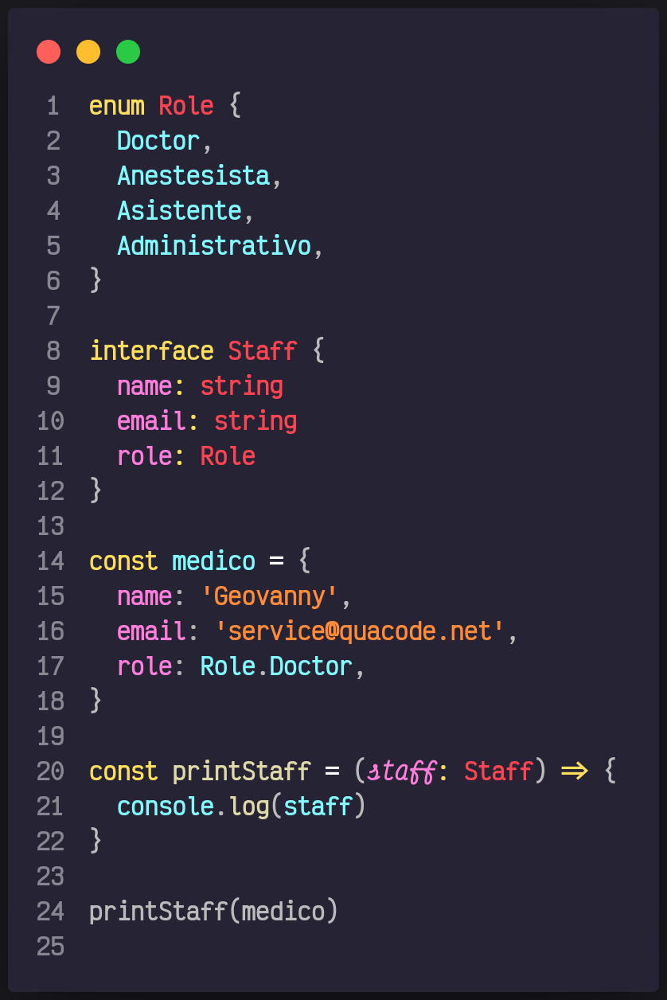

# 11. Interface

Tenemos un objecto medico el cual deseamos dar los atributos `name, email, role` y luego pintar por pantalla nuestro objecto médico.
Podríamos hacer esto de la siguiente forma

1. Creamos un `enum` que nos permite enumerar ciertos valores para utilizarlos en nuestro proyecto.
2. Creamos nuestro objecto medico.
3. Creamos una función que reciba a nuestro medico con su respectivo tipo `staff: { name: string; email: string; role: Role }` y que luego lo imprimirá por pantalla.

Ahora supongamos que a nuestro objeto medio lo necesitamos pasar a distintas funciones. Quedaría muy feo colocar todo el tipo `staff: { name: string; email: string; role: Role }` en todas las funciones. Es ahi cuando entra `interface` esta nos permiten declarar un tipo y utilizarlo en donde lo necesitemos así que pasaríamos de esto `staff: { name: string; email: string; role: Role }` a simplemente esto `staff: Staff`.

Como buena práctica recuerda escribir tu `interface` siempre con la primera letra en mayúscula.

